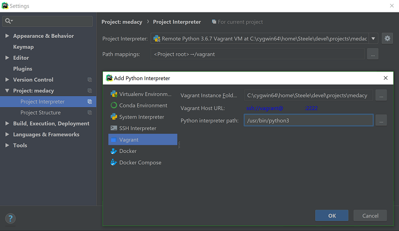

# Utilizing Vagrant

[Vagrant](https://www.vagrantup.com/) is a command line utility for creating project-specific virtual machines (VMs).
MedaCy implements Vagrant to enable development on different platforms, including Windows.
This guide will instruct you on how to use Vagrant within PyCharm or from the command line.

## Installations

The only additional software you need to utilize Vagrant is VirtualBox and Vagrant itself.
 
### Installing VirtualBox

[VirtualBox](https://www.virtualbox.org/) is an open-source program for implementing virtual machines.
Vagrant will utilize it to create your medaCy virtual machine.
You can download the version appropriate for your machine [here](https://www.virtualbox.org/wiki/Downloads)
and follow the installation instructions that they provide.

### Installing Vagrant

Go to the [installation page](https://www.vagrantup.com/downloads.html) for Vagrant and select the version
appropriate for your machine.

## Vagrant for medaCy

Each project that uses Vagrant requires there to be a file in the root directory of the project named
Vagrantfile. MedaCy distributes with this file already configured. 

### At the command line

### Vagrant up

From the command line, navigate to the directory containing your clone of medaCy, and run this command:

```bash
$ vagrant up
```

This command will "turn on" your new medaCy VM. You will be using this command every time you want to
start up your VM, but since this is its first activation, it will take a while.
While you wait, the operating system for the medaCy VM (Ubuntu), Python 3, and medaCy and all its dependencies
are being installed. Once these downloads complete, 
you won't have to wait for them every time you run `vagrant up`.

### Let's take a look

Now run:

```bash
$ vagrant ssh
```

When this command finishes, you'll be inside your new VM. Specifically, you'll be in the home folder.
You don't particularly need to be here, so run these commands:

```bash
vagrant@ubuntu-bionic:~$ cd ../..
vagrant@ubuntu-bionic:/$ cd vagrant
vagrant@ubuntu-bionic:/vagrant$ ls
```

After running the first command, you could run `$ ls` to see the root directory of your 
VM, if you feel so inclined. We're interested in what's in the `/vagrant` subdirectory.
It should look familiar, like the root directory of your medaCy project. Why is that?
*Because it is!* The `/vagrant` directory of the VM is shared between the VM and the 
directory on the host machine containing the Vagrantfile.

### So should I continue by setting up a virtual environment for medaCy?

No. Think of your VM as an enhanced virtual environment. When the VM was created, medaCy
 and all of its dependencies were installed on the base installation of Python 3.
 In theory, you'll only be using this VM for medaCy, so there's no need to 
 create a separate environment for it.

### Exiting and turning off the VM

Having a VM running requires a lot of resources from your host machine. When you're
done using the VM, run these commands.

```bash
vagrant@ubuntu-bionic:~$ exit
$ vagrant halt
```

`$ exit` will leave the VM from the command line but leave it running in the background;
`$ vagrant halt` will turn it off.

## In PyCharm

### Tools > Vagrant > Up

PyCharm Professional Edition provides features for interacting with Vagrant VMs.
This guide assumes that you are familiar with PyCharm.

Open your medaCy project in PyCharm and select Tools > Vagrant > Up. This is the same
as running `$ vagrant up` from the terminal.

### Tools > Start SSH session...

Likewise, Tools > Start SSH session... is the same as `$ vagrant ssh`. PyCharm will list
your Vagrant VM as an option to SSH into. You will then be able to interact with the VM at
its own terminal.

### Configuring the interpreter

While you're developing medaCy, you will probably want to utilize all of PyCharm's features.
Select File > Settings, and then on the settings menu, select Plugins. Enable the
Remote Interpreter plugin. 

Once remote interpreters are enabled for PyCharm, you will need to configure the remote interpreter
for this project. The plugin is already designed to work with Vagrant, so this will be easy.

Again, go to File > Settings, and select Project: medacy > Project Interpreter. Select the gear
icon on the right side of the dialogue box and select "add". Another dialogue box will appear.
Select "Vagrant" on the left side of the new box. Set the Python interpreter path to 
`usr/bin/python3`.



